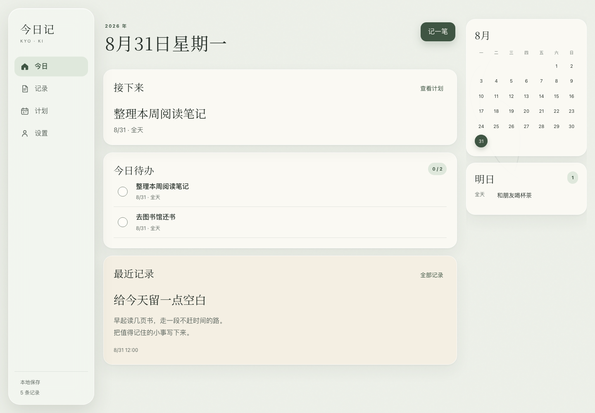
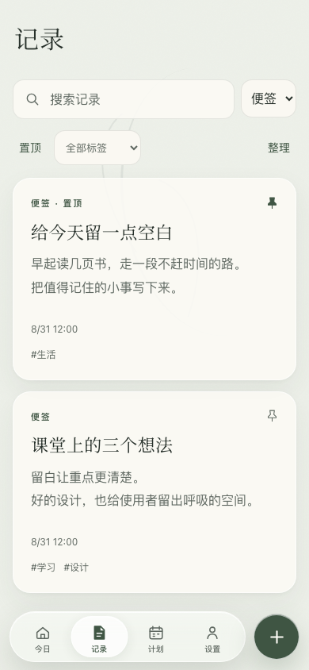
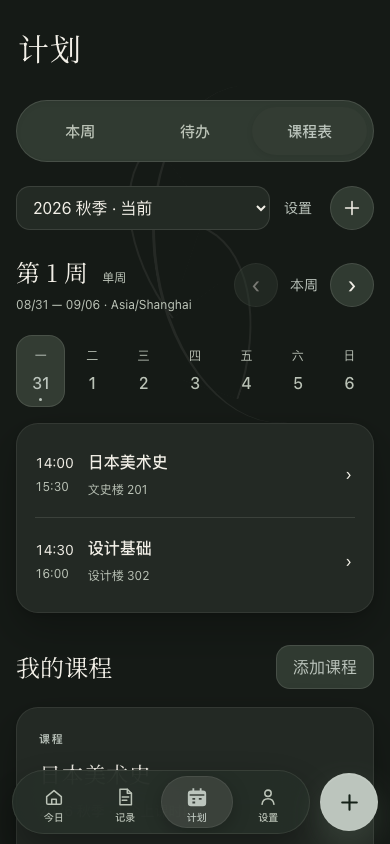

<p align="center">
  
</p>

<h1 align="center">今日记</h1>

<p align="center">在一处安静地记录今天、完成事情、安排课程。</p>

<p align="center">
  <a href="https://ibka512.github.io/jinriji/"><strong>在线使用</strong></a> ·
  <a href="#开始使用">开始使用</a> ·
  <a href="#本地开发">本地开发</a> ·
  <a href="./docs/version-history.md">更新记录</a> ·
  <a href="https://github.com/ibka512/jinriji/issues">反馈问题</a>
</p>

<p align="center">
  <a href="https://github.com/ibka512/jinriji/actions/workflows/ci.yml"></a>
  <a href="https://github.com/ibka512/jinriji/actions/workflows/pages.yml"></a>
  
</p>

今日记是一款将便签、备忘录、待办、日程与课程表放在一起的个人工具。无需注册，打开浏览器就能开始；记录保存在当前设备的浏览器中，也可以安装到主屏幕使用。

界面以和纸、中文衬线体和低饱和配色营造安静的阅读氛围，导航与操作层使用液态玻璃质感。手机采用胶囊 Tab Bar 与圆形新建按钮，平板和宽屏采用侧栏布局，浅色与深色模式跟随系统。

> **在线地址：[ibka512.github.io/jinriji](https://ibka512.github.io/jinriji/)**
>
> 今日记目前是本地优先的 Web 应用，**不提供账户、云同步或系统提醒**。重要内容请定期导出备份。

## 界面预览

下图来自应用实际运行界面。内容是隔离环境中的演示记录，不会写入你的浏览器数据。



<p align="center">
  
  &nbsp;&nbsp;
  
</p>

## 可以做什么

| 场景 | 已有能力 |
| --- | --- |
| 看今天 | 真实日期、接下来的安排、今日待办、最近记录与明日预览 |
| 随手记录 | 便签、待办与日程；搜索标题、正文和标签；置顶与标签筛选 |
| 安静写作 | 轻富文本、自动保存、历史版本、查找替换、字符统计、衬线正文和专注模式 |
| 整理笔记 | 单层笔记本、批量移动、紧凑列表、模板、笔记链接、命中上下文与三种排序 |
| 连接知识与行动 | 选段生成待办并保留来源；笔记关联课程；本地图片与简单表格 |
| 整理事项 | 待办按逾期、今天、以后和未设日期分组；批量置顶、加标签、完成和删除 |
| 重复待办 | 按日、周或月重复；完成后生成下一次，支持安全撤销 |
| 安排课程 | 学期、周次、单双周、多个上课时段、单次调课与停课；课程可关联记录 |
| 继续上次 | 记录草稿恢复、返回时保留筛选与列表位置、编辑冲突提示、最近删除 |
| 随身使用 | 手机／平板／桌面布局、离线编辑、主屏幕安装、键盘操作与减少动态适配 |
| 管理数据 | JSON 完整备份、导入预览、事务回滚及最近一次恢复点 |

### v0.10：日常体验打磨（已并入 v1.0 RC）

- 笔记用“创建关联待办”连接行动，原文保持不变。旧版富文本待办继续保留图片、表格与链接，不再静默降为纯文本。
- 撤销、重做、标题和加粗常驻一行；其他工具按格式、插入、写作分组。阅读与编辑共用排版基准，长文固定显示返回、保存状态和完成。
- 记录页收起低频筛选与管理；支持批量移动笔记、清除筛选、命中上下文和排序，大列表分段展示。
- 添加课程时可一次保存资料与首个上课时段；详情保持在计划页。日程默认继承日期，旧版未设日期日程显示在“待安排日期”。
- 设置常驻版本、更新检查与重试；启动失败显示保留数据的恢复说明。通知到期退出键盘焦点顺序，减少动态模式保留清晰反馈。

此次没有新增生产依赖或升级数据库，相关改进已随 v1.0 RC 部署。验证范围与真机边界见 [v0.10 验证记录](./docs/v0.10-verification.md)。

### v1.0 RC：正式版候选体验（已部署，待真机验收）

- 交互动效统一到同一套 140／180／240ms 节奏：键盘、输入与撤销即时，菜单、通知和短表单只在帮助理解状态时过渡。
- 待办完成后焦点前往下一个可处理事项；通知可主动关闭、悬停或聚焦时暂停，关闭后退出键盘顺序并返回合理位置。
- 通知播报与撤销／关闭按钮语义分离；关键手机和桌面界面的可见控件具有可访问名称与至少 44px 的触控目标。
- 四套主题的深浅色正文、辅助文字和主按钮对比度均达到 4.5:1；补齐透明度、增强对比度、强制颜色、减少动态和触摸悬停降级。
- 离线缓存按应用版本和构建指纹隔离；更新下载失败保留当前版本与数据，重试成功后再激活。

当前是 `1.0.0-rc.1`，不等于已正式发布。真实 iPhone／Safari、Android 输入法和 VoiceOver 仍需设备验收，见 [v1.0 候选版验证记录](./docs/v1.0-verification.md)。

### 页面式写作与笔记整理

笔记不再在弹窗中编辑。宽屏是导航、紧凑列表与正文三栏；空间不足时进入完整笔记页。已有笔记先阅读，点正文或“编辑”开始输入；新建直接书写。手机写作时收起底部导航，“完成”后回到阅读。切换笔记、侧栏导航和浏览器返回都会先等待保存；失败或冲突时留在原文。

- **笔记本**：创建、重命名、筛选；在“笔记信息”中归类。删除笔记本只将内容移至未分类，不删除笔记。
- **内置模板**：空白笔记、每日记录、课堂笔记、读书摘录；始终新建，不覆盖正在写的正文。
- **笔记链接**：在“更多 → 笔记链接”选择另一篇；阅读页显示关联记录，已移除的链接有提示。
- **选段转待办**：选择正文，再用“更多 → 选段转待办”；原文保持不变，待办保留来源和关联课程。
- **图片与表格**：图片在本机压缩保存，不上传。支持 PNG／JPEG／WebP，原文件最多 10 MB／1600 万像素，保存后最长边 1600px、单张约 512 KB。在当前段落或表格之后插入。表格默认 3×3，可增删行列，最多 20 行、8 列，不含合并、公式和嵌套。

### 持续保留的写作能力

便签正文现在支持标题、粗体、斜体、删除线、高亮、引用、列表、勾选清单、链接和分隔线，也支持常用 Markdown 输入快捷方式。网页粘贴只保留编辑器支持的格式，不带入网页颜色、图片或脚本；打开“纯文本粘贴”可按字面粘贴文字。

- **自动保存**：停止输入约 600ms 后写入本机，只有事务成功才显示“已保存到本机”。“完成”、关闭和 Escape 会先保存再离开；待办、日程、课程继续使用显式保存及草稿恢复。
- **冲突保护**：另一窗口修改同一篇时不会覆盖；当前输入和恢复草稿保留，可另存副本。保存失败时可直接从编辑器导出 TXT／Markdown。
- **写作工具**：段落内查找、逐处／全部替换、撤销／重做、正文及选区字符统计、恢复上次关闭时的光标和滚动位置。字符数不含空白，汉字、字母、标点和 emoji 按 Unicode 码点计数。
- **安静排版**：“衬线正文”切换正文字体，“宽松行距”调整行距，“专注写作”收起导航并扩大稿纸。常用工具无需横向寻找，低频工具在“更多”中分组呈现。
- **历史与导出**：每次编辑会话的首次修改及后续约一分钟间隔保留旧版本，恢复前另留安全版本；每篇最多 20 份、全站最多 100 份。TXT 保留文字；基础 Markdown 保留标题、粗斜体、删除线、列表、清单、引用和链接，高亮／下划线降为普通文字。

这是轻量的个人写作工具，不是办公套件：不包含任意文件附件、多人协作、AI 或云服务。TXT 不携带图片；Markdown 用图片占位说明并保留基础表格，完整图片请使用 JSON 备份。详见[写作与数据安全说明](./docs/writing.md)。

## 开始使用

1. 打开[今日记](https://ibka512.github.io/jinriji/)，在今日或记录页点击 **＋**／“记一笔”开始笔记。在计划页新建对应的待办、日程或课程。
2. 在“记录”中按笔记本、类型、标签和关键词查找内容；编辑时在“笔记信息”中归类。阅读或列表状态下，“整理”可批量处理当前筛选结果。
3. 在“计划”中切换 **本周／待办／课程表**。新建学期后，添加课程会默认使用当前学期，可同时填写首个时段；之后在课程详情追加时段。也可选择暂不重复排课，保留单次课程或只建资料。
4. 在“设置”中选择主题、导出备份，或查看最近删除和离线页面状态。

重复待办需要设置日期。它按原计划日期推进，每次完成只生成一个未来事项，逾期时跳过遗漏日期；月末任务在短月收拢，之后恢复原日号。若自动生成的下一次已被编辑、删除或完成，撤销先前的完成会被阻止，避免覆盖后续内容。

课程单双周从学期第一周计算。学期保留创建时的时区，课程表使用学期当地时间；首页及本周安排使用设备时间。点击某个具体课次可只调整这一节，不会改变其他课次。

### 安装、离线与更新

- **iPhone / iPad**：在 Safari 中打开站点，通过分享菜单选择“添加到主屏幕”。
- **Android**：在支持安装的浏览器中选择“安装应用”或“添加到主屏幕”。
- **桌面**：在支持安装的浏览器中使用地址栏或菜单中的安装入口，也可直接作为普通网页使用。

菜单名称和安装能力由浏览器决定。首次使用请保持联网，让页面资源完成缓存；可在设置中确认离线页面是否就绪。已缓存页面支持离线记录和编辑，未缓存的字体字形可能使用系统字体回退。

出现“新版本已经准备好”时，先保存当前输入，再点击“更新”；错过通知也可在“设置 → 应用更新”中处理。更新不会主动清除记录。操作系统可能缓存旧的主屏幕图标，图标刷新时间取决于平台；不要为了刷新图标直接清除站点数据或卸载应用，请先导出备份。

### 常用快捷键

| 快捷键 | 操作 |
| --- | --- |
| `⌘ / Ctrl + K` | 快速记录 |
| `⌘ / Ctrl + Enter` | 保存编辑内容 |
| `N` | 按当前页面新建 |
| `/` | 搜索记录 |
| `Alt + 1 / 2 / 3 / 4` | 切换今日、记录、计划、设置 |
| `?` | 查看快捷键帮助 |

单键快捷操作在文字输入时不会触发。分段切换与主题选择也支持键盘操作。

## 数据与隐私

记录、课程、记录草稿和写作历史保存在 **IndexedDB**；部分界面偏好保存在 **localStorage**。旧版记录草稿会一次性迁移，原始 localStorage 副本保留。应用没有账户服务器，不把你的记录上传到云端。站点资源由 GitHub Pages 提供，正常访问仍会产生托管平台的网络请求。

本地保存不等于永久备份，也不等于加密保险箱。不同设备、浏览器或站点地址的数据不会自动共享；清除浏览器数据、隐私模式结束或系统回收存储都可能造成丢失。重要内容请通过“设置 → 导出备份”保存为独立文件。

- 当前导出 **v6 JSON**，包含结构化正文、笔记本、正文引用的图片、来源链接、记录、课程、学期、排课规则、单次调整、主题，以及置顶、标签和重复待办信息；可导入 v1–v6。
- **导入是替换，不是合并。** 导入前会校验并预览，确认后在同一个事务中建立恢复点并替换数据，失败则回滚。旧备份没有的排课数据会被清空，确认前请阅读预览。
- 仅保留最近一个本地导入恢复点。草稿、写作历史和恢复点不包含在导出文件中，也无法抵御浏览器数据清除。
- 旧版 localStorage 原始数据及迁移备份会保留。数据库 v2 添加草稿和历史表，v3 只再添加笔记本与图片表，不批量改写旧正文。旧应用不能直接打开新版数据库。回退前必须另存 v6 备份和所需 TXT／Markdown，不要通过清空数据库降级。
- 单个备份最大 64 MB；记录与课程各最多 20,000 条、笔记本 1,000 个、图片 2,000 张、学期 100 个、排课规则 2,000 条、单次调整 10,000 条。超过总大小时会拒绝导出／导入，并保留本机原数据。

## 设计与图标

今日记使用本地加载的 **Noto Serif SC**，使手机也能呈现中文衬线标题；正文和操作文字保持清晰易读。玻璃质感用于导航与操作层，正文采用较实的纸张表面，并尊重系统减少动态和降低透明度偏好。

当前提供四套经过调校的和风主题，以语义色令牌联动界面，取意于莫奈配色。**当前尚未实现从壁纸自动取色的完整 Monet 算法。** 计划页分段切换参考 [IBKA UI-001](https://github.com/ibka512/ibka-ui-designs/tree/main/components/segmented-switch)。

软件图标采用用户提供的朱红圆相与日轮，保留和纸纹理。图标母版经过构图适配，提供 favicon、Apple Touch Icon 与 PWA 图标；PNG 标记区域保留系统裁切安全边距。图标不会重新出现在侧栏文字品牌旁。

- [设计规范](./design-system.md)
- [图标来源、尺寸及再生成方式](./docs/branding/README.md)
- [历史更新记录](./docs/version-history.md)

## 本地开发

使用 **Node.js 24** 与 npm，与 GitHub Actions 保持一致：

```bash
git clone https://github.com/ibka512/jinriji.git
cd jinriji
npm ci
npm run dev
```

访问终端显示的 Vite 地址，默认是 `http://localhost:5173`。开发模式不注册 Service Worker，避免旧缓存影响热更新。

```bash
npm run check   # TypeScript 类型检查
npm test        # 单元测试
npm run build   # 类型检查、生产构建与离线资源清单
npm run preview # 预览 dist/，默认端口 4173
```

技术栈为 **TypeScript + Vite + 原生 HTML/CSS + Dexie + Tiptap / ProseMirror**，无需后端服务。Tiptap 使用 MIT 开源组件，无商业扩展或编辑服务。主要目录：

```text
src/
  domain/       日期、待办、课程与备份数据类型
  data/         IndexedDB 仓储、迁移、草稿和备份
  features/     记录、课程及页面功能
  platform/     离线状态和 Service Worker 注册
  ui/           导航、主题、弹窗和界面控制
public/         图标、字体、Manifest 和 Service Worker
scripts/        构建后离线清单、favicon 打包
tests/          单元测试和浏览器验收
docs/           界面预览、图标母版和历史说明
```

### 浏览器验收

验收脚本使用隔离的 Chromium 浏览器数据，只允许对本地站点运行。首次运行需准备 Python 3 和 Playwright：

```bash
python3 -m venv .venv
source .venv/bin/activate
python3 -m pip install playwright==1.55.0
python3 -m playwright install chromium
npm run build
python3 -m http.server 4173 --bind 127.0.0.1 --directory dist
```

保持服务运行，在另一个已激活相同 Python 环境的终端执行：

```bash
python3 tests/ui_acceptance.py
python3 tests/timetable_acceptance.py
python3 tests/organization_acceptance.py
python3 tests/writing_acceptance.py
python3 tests/library_acceptance.py
python3 tests/maturity_acceptance.py
```

验收脚本覆盖记录、课程、整理、页面式写作、笔记本与模板、跨篇链接、选段待办、图片表格、备份、离线、实际更新安装及多标签页冲突，也检查多端尺寸、深色模式、减少动态与大字号。写作专项包含模拟中文组合输入、真实 IndexedDB 锁下连续输入、保存失败恢复及 1 万／5 万／20 万字符边界。v1.0 候选版截图输出到 `test-results/screenshots-v1.0/` 与 `test-results/screenshots-v1.0-webkit/`。WebKit 自动化不等于真实 Safari，这些结果也不等同于真实手机或输入法验证。

### 部署

推送到 `main` 后会触发两个独立工作流：

- [Quality checks](https://github.com/ibka512/jinriji/actions/workflows/ci.yml)：类型检查、单元测试、生产构建和浏览器验收。
- [Deploy to GitHub Pages](https://github.com/ibka512/jinriji/actions/workflows/pages.yml)：构建并部署 `dist/`。

两条工作流并行运行，Pages 成功不代表质量验收已通过；发布时需确认两者均成功。构建使用相对资源路径，可部署在 GitHub Pages 的仓库子路径下。Service Worker 预缓存页面、版本化 JS/CSS 和图标，新版本等待用户确认后激活。

## 当前边界与反馈

当前不支持云同步、系统通知提醒、教务系统导入、跨夜课程或跨学期调课。学期和排课表单会在离开前保护未保存输入，但不提供刷新后的自动恢复；记录编辑器支持草稿恢复。真实 iPhone / Safari 和各手机系统的主屏幕图标效果仍需实机验证。

欢迎通过 [Issues](https://github.com/ibka512/jinriji/issues) 提交问题。请注明设备、浏览器版本、复现步骤和预期结果；截图与备份请先去除个人信息，勿上传私人笔记或完整个人备份。

## 来源与许可

- Noto Serif SC 使用 [SIL Open Font License 1.1](./public/fonts/noto-serif-sc/OFL.txt)。
- UI-001 的来源与 MIT 许可保留在 [第三方声明](./public/third-party-notices.txt)。
- Tiptap、ProseMirror 及其依赖的原始许可在构建时收集到 `dist/third-party-licenses.txt`，随站点分发。
- 图标由项目用户提供，经构图适配后用于本项目；未单独授予第三方品牌使用许可。
- 仓库目前没有为项目整体指定开源许可证。公开可见不代表已授权任意再分发；第三方组件遵循各自许可。
