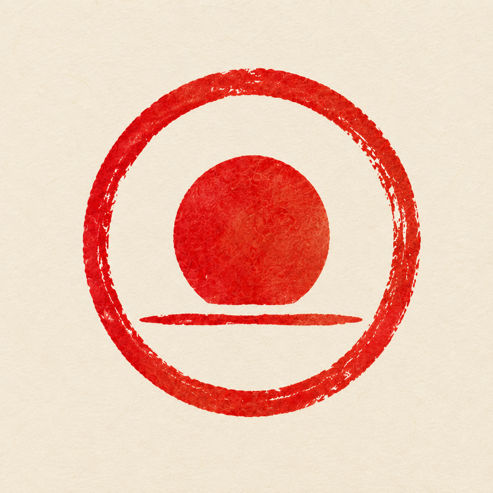

# 今日记图标

[返回项目首页](../../README.md)



## 来源与适配

原图由项目用户提供，保存在 [icon-original.png](./icon-original.png)，尺寸 1254×1254。
使用内置 imagegen 编辑构图，去掉外侧白边并放大居中的图案，保留朱红圆相、日轮、水平笔触和和纸纹理；没有重新添加侧栏品牌图标。

编辑后的 [icon-master.png](./icon-master.png) 实际仍为 1254×1254，另存 1024×1024 交付母版。所有应用尺寸均从母版缩小生成，没有将插值放大声称为额外细节，也没有用简单矢量图替换笔触。

## 资源

| 文件 | 尺寸 | 用途 |
| --- | --- | --- |
| icon-original.png | 1254×1254 | 用户原始图，保留不改 |
| icon-master.png | 1254×1254 | 构图适配后的母版 |
| icon-1024.png | 1024×1024 | 高分辨率交付与后续平台适配 |
| ../../public/icons/app-512.png | 512×512 | PWA 通用与 maskable 安装图标 |
| ../../public/icons/app-192.png | 192×192 | PWA 小尺寸图标 |
| ../../public/icons/apple-touch-icon.png | 180×180 | Apple 主屏幕图标 |
| ../../public/icons/favicon-16.png | 16×16 | 小尺寸标签页图标 |
| ../../public/icons/favicon-32.png | 32×32 | 高密度标签页图标 |
| ../../public/icons/favicon-48.png | 48×48 | 较大标签页与快捷方式图标 |
| ../../public/favicon.ico | 16 / 32 / 48 | 多尺寸 ICO 回退 |

图案保留在画布中央半径 40% 的圆形安全区内；背景不预裁圆角，由系统应用自己的遮罩。依据 [maskable 图标安全区说明](https://web.dev/articles/maskable-icon)和 [Manifest icons 文档](https://developer.mozilla.org/en-US/docs/Web/Progressive_web_apps/Manifest/Reference/icons)配置用途与真实像素尺寸。母版和原图仅保留在文档目录，不进入应用离线预缓存。

## 再生成

以下是在本次 macOS 环境使用的尺寸导出流程，不参与生产构建，也不增加运行时依赖。在仓库根目录执行：

```bash
sips -z 1024 1024 docs/branding/icon-master.png --out docs/branding/icon-1024.png
sips -z 512 512 docs/branding/icon-master.png --out public/icons/app-512.png
sips -z 192 192 docs/branding/icon-master.png --out public/icons/app-192.png
sips -z 180 180 docs/branding/icon-master.png --out public/icons/apple-touch-icon.png
sips -z 48 48 docs/branding/icon-master.png --out public/icons/favicon-48.png
sips -z 32 32 docs/branding/icon-master.png --out public/icons/favicon-32.png
sips -z 16 16 docs/branding/icon-master.png --out public/icons/favicon-16.png
node scripts/package-favicon.mjs
```

其他系统可用支持高质量缩小的图像工具导出相同 PNG 尺寸，再运行 Node 脚本将小尺寸 PNG 封装为 ICO。导出资源已提交，普通开发和 CI 不需要重新生成。替换图标时同时递增 Service Worker 缓存版本并核对 Manifest 与 HTML 引用。

## 图像编辑提示词

使用内置 imagegen，原图作为 edit target。实际请求如下（请求的 2048 尺寸未由工具返回，以文件真实的 1254 尺寸为准）：

> Use case: precise-object-edit. Asset type: square high-resolution app icon master for 今日记. Image 1 is the edit target, NOT mere style reference. Preserve its distinctive vermilion red circular brush seal with a flat-bottomed rising sun above a thin horizontal brushstroke, all proportions between the three mark elements and the textured ink identity. Change ONLY framing/technical quality: remove the narrow outer white border, fill the entire square canvas edge-to-edge with the same warm ivory washi paper, enlarge the whole existing mark together so its outer diameter occupies 74% of the square (center at 50% x 50%, equal padding), making it easy to recognize at small sizes and staying inside the central maskable safe circle. Clean high-resolution square 2048x2048 output if supported. Preserve handcrafted imperfect brush edges and red ink texture; keep the paper texture subtle and same cream palette. This is adapting the user's supplied icon, not redesigning it. No new shapes, no text, no logo mockup, no rounded square container, no drop shadow, no gradients, no white frame, no transparency. Do not change the circle or sun geometry except uniform scaling/recentering.
